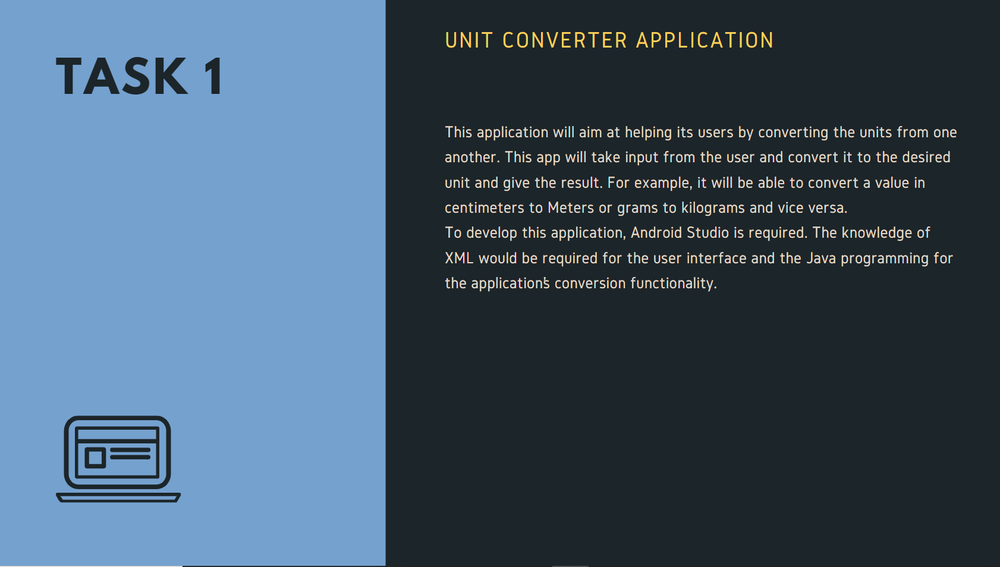
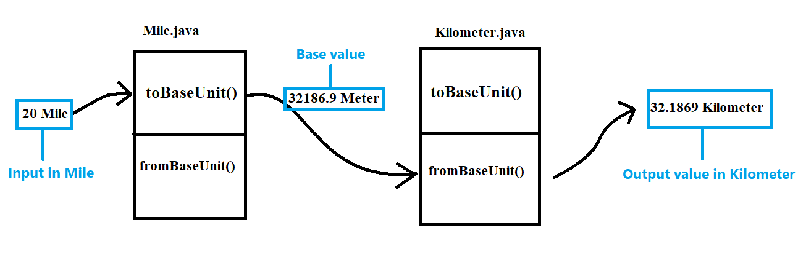
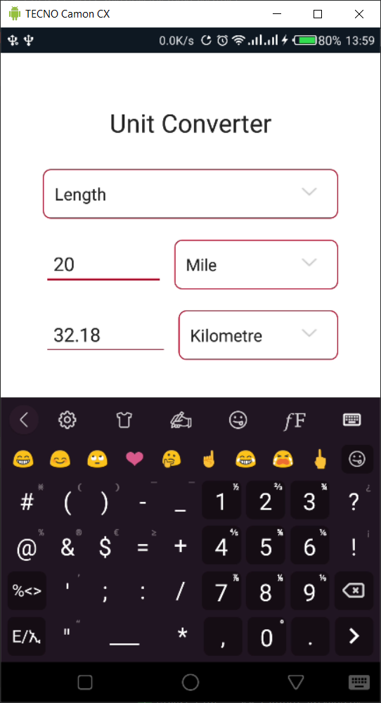
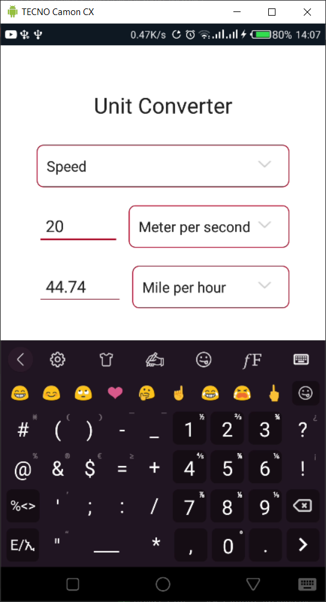
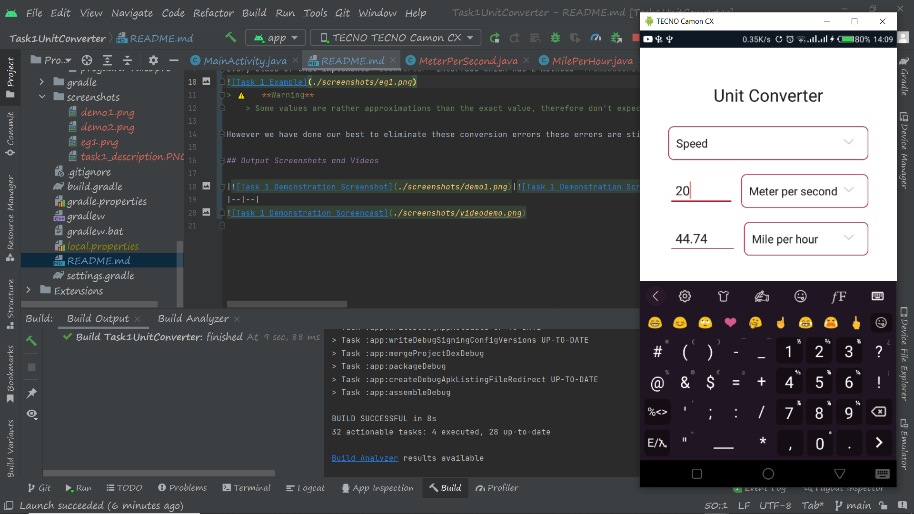

# Unit Converter Application

This application is a simple unit converter. The project was initiated by an   internship opportunity given to me by a company called [OASIS Info Byte](https://oasisinfobyte.com/).  This project is a completion of task 1 in the list of tasks that was given in the internship program.

## Methodology Description
This app is built on java programming language. We have 11 categories of Units in this application. This app can theoretically convert any unit in a given category from one to another. 

Every class of unit implements `IConverter` interface which has 2 methods `fromBaseUnit()` and `toBaseUnit()`. This way any given unit only needs to know how to convert itself to a given **SI** unit we call base unit and convert from that unit to itself. Therefore when we convert between 2 units that are not an **SI** units, we first need to convert the first unit to the base unit and then we can use the 2nd class to convert from base to itself. Therefore every class is first converted from itself to the base unit and the class of unit that we want to get converts the value from the base unit to itself. For eg. We need to convert from **Mile** to **Kilometer** in a **Length** category. The following picture shows how the process is done:

> ⚠️ **Warning** 
	> Some values are rather approximations than the exact value, therefore don't expect to get similar values as other converter applications. 
	
However we have done our best to eliminate these conversion errors these errors are still possible.

## Output Screenshots and Videos

--
    
